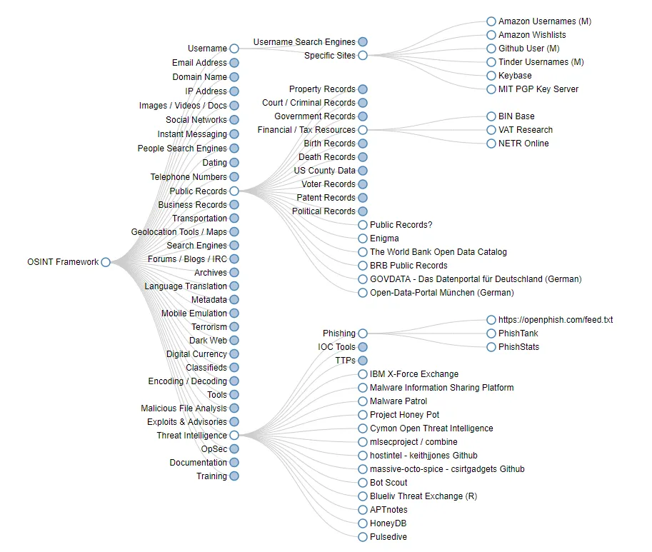

# OSINT (Inteligencia de Fuentes Abiertas)

OSINT, siglas en inglés de "Open Source Intelligence" (Inteligencia de Fuentes Abiertas), es el proceso de recopilar, analizar y utilizar información obtenida de fuentes accesibles al público para obtener inteligencia accionable. Estas fuentes pueden incluir una variedad de medios y plataformas, tales como:

1. **Medios de comunicación tradicionales**: Periódicos, revistas, radio y televisión.
2. **Internet**: Páginas web, blogs, foros y redes sociales.
3. **Publicaciones académicas y técnicas**: Libros, artículos de revistas académicas, estudios e informes técnicos.
4. **Registros públicos**: Documentos gubernamentales, registros judiciales, patentes y registros comerciales.
5. **Multimedia**: Videos, fotografías y grabaciones de audio disponibles públicamente.

OSINT se utiliza en diversos campos, incluyendo:

- **Seguridad nacional y militar**: Para monitorear y evaluar amenazas potenciales.
- **Ciberseguridad**: Para detectar vulnerabilidades y amenazas en el ámbito digital.
- **Investigación empresarial**: Para analizar competidores y tendencias del mercado.
- **Periodismo de investigación**: Para descubrir y documentar información relevante sobre temas de interés público.

El proceso de OSINT implica varias etapas clave:

1. **Recopilación de datos**: Buscar y reunir información relevante de fuentes abiertas.
2. **Evaluación de la información**: Verificar la autenticidad, precisión y relevancia de los datos obtenidos.
3. **Análisis de la información**: Interpretar y contextualizar los datos para obtener inteligencia útil.
4. **Difusión de la inteligencia**: Comunicar los hallazgos a las partes interesadas de manera clara y efectiva.

OSINT se diferencia de otros tipos de inteligencia (como HUMINT, inteligencia humana, y SIGINT, inteligencia de señales) en que no requiere técnicas encubiertas o el acceso a información clasificada.

https://osintframework.com/