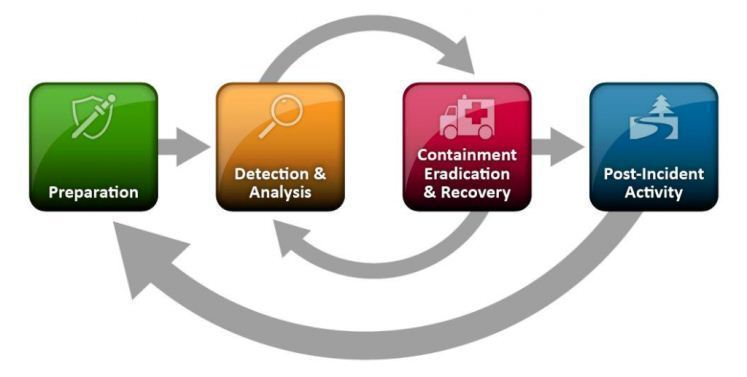
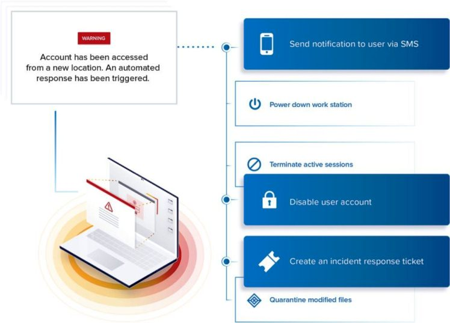

# Introducción a la gestión de la respuesta a incidentes de ciberseguridad y a las mejores prácticas

A medida que los ciberataques siguen creciendo en volumen, diversidad y sofisticación, además de ser más perturbadores y dañinos, las organizaciones deben estar preparadas para manejarlos con eficacia.

Además de desplegar soluciones y prácticas de seguridad eficaces, necesitan tener la capacidad de identificar y hacer frente rápidamente a [los ataques](https://geekflare.com/es/real-time-cyber-attacks/), y garantizar así que los daños, las perturbaciones y los costes sean mínimos.

Todo sistema informático es un objetivo potencial de un ciberataque, y la mayoría de la gente está de acuerdo en que no es una cuestión de si ocurrirá, sino de cuándo ocurrirá. Sin embargo, el impacto varía en función de la rapidez y eficacia con que se aborde el problema, de ahí la necesidad de estar preparados para responder a incidentes.

Una respuesta a incidentes de ciberseguridad (RI) se refiere a una serie de procesos que una organización lleva a cabo para hacer frente a un ataque contra sus sistemas informáticos. Esto requiere una combinación de las herramientas de hardware y software adecuadas, así como prácticas como una planificación, procedimientos, formación y apoyo adecuados por parte de todos los miembros de la organización.

## Buenas prácticas antes, durante y después de los incidentes de seguridad

Cuando se produce un ciberataque, pueden llevarse a cabo múltiples actividades simultáneamente, y esto puede resultar agitado cuando no existe coordinación ni procedimientos adecuados de gestión de incidentes.

Sin embargo, prepararse con antelación y establecer un plan y unas políticas de respuesta a incidentes claros y fáciles de entender permite a los equipos de seguridad trabajar en armonía. Esto les permite centrarse en las tareas críticas que limitan el daño potencial a sus sistemas informáticos, datos y reputación, además de evitar interrupciones innecesarias del negocio.

### Preparación de un plan de respuesta a incidentes

Un plan de respuesta a incidentes documenta los pasos a seguir en caso de ataque o cualquier otro problema de seguridad. Aunque los pasos reales pueden variar según el entorno, un proceso típico, basado en el marco SANS (SysAdmin, Audit, Network, and Security), incluirá la preparación, identificación, contención, eliminación, recuperación, notificación del incidente y una revisión posterior al mismo.

*Flujo del proceso de respuesta a incidentes (basado en la plantilla del NIST) [NIST](https://nvlpubs.nist.gov/nistpubs/SpecialPublications/NIST.SP.800-61r2.pdf)*

La preparación incluye el desarrollo de un plan con la información relevante y los procedimientos reales que el equipo de respuesta a incidentes informáticos (CIRT) seguirá para abordar el incidente.

Estos incluyen:

- Equipos e individuos específicos responsables de cada paso del proceso de respuesta a incidentes.
- Definición de lo que constituye un incidente, incluyendo qué justifica qué tipo de respuesta.
- Datos y sistemas críticos que requieren más protección y salvaguarda.
- Una forma de preservar los estados afectados de los sistemas afectados con fines forenses.
- Procedimientos para determinar cuándo y a quién notificar un problema de seguridad. Cuando se produce un incidente, puede ser necesario informar a los usuarios afectados, a los clientes, al personal encargado de hacer cumplir la ley, etc., pero esto diferirá de un sector y de un caso a otro.

Un plan de respuesta a incidentes debe ser fácil de entender y aplicar, así como alinearse con otros planes y políticas de la organización. Sin embargo, la estrategia y el enfoque pueden diferir según las distintas industrias, equipos, amenazas y daños potenciales. Las pruebas y actualizaciones periódicas garantizan la validez y eficacia del plan.

## Pasos de la respuesta a incidentes cuando se produce un ciberataque

Una vez que se produce un incidente de seguridad, los equipos deben actuar con rapidez y eficacia para contenerlo y evitar que se propague a sistemas limpios. A continuación se indican las mejores prácticas a la hora de abordar los problemas de seguridad. Sin embargo, éstas pueden diferir según el entorno y la estructura de una organización.

### Reúna o contrate al equipo de respuesta a incidentes informáticos

Asegúrese de que el equipo CIRT multidisciplinar, interno o subcontratado, cuenta con las personas adecuadas, con las aptitudes y la experiencia adecuadas. De entre ellos, seleccione a un líder de equipo que será la persona central para dar dirección y garantizar que la respuesta se desarrolle de acuerdo con el plan y los plazos previstos. El líder también trabajará codo con codo con la dirección y especialmente cuando haya que tomar decisiones importantes en cuanto a las operaciones.

### Identificar el incidente y establecer el tipo y el origen del ataque

Ante cualquier indicio de amenaza, el equipo de IR debe actuar con rapidez para verificar si se trata realmente de un problema de seguridad, ya sea interno o externo, al tiempo que se asegura de contenerlo lo antes posible. Las formas típicas de determinar cuándo hay un problema incluyen, entre otras, las siguientes

- Alertas de herramientas de supervisión de la seguridad, fallos en el funcionamiento de los sistemas, comportamientos inusuales, modificaciones, copias o descargas de archivos inesperadas o inusuales, etc
- Informes de usuarios, administradores de redes o sistemas, personal de seguridad o socios o clientes externos.
- Registros de auditoría con indicios de comportamientos inusuales de usuarios o sistemas, como múltiples intentos fallidos de inicio de sesión, descargas de archivos de gran tamaño, uso elevado de memoria y otras anomalías.

*Alerta automática de incidentes de seguridad de [Varonis](https://www.varonis.com/solutions/threat-detection-response/)*

### Evalúe y analice el impacto del ataque

Los daños que causa un ataque varían en función de su tipo, de la eficacia de la solución de seguridad y de la velocidad de respuesta del equipo. La mayoría de las veces, no es posible ver el alcance de los daños hasta después de haber resuelto completamente el problema. El análisis debe averiguar el tipo de ataque, su impacto y los servicios que podría haber afectado.

También es una buena práctica buscar cualquier rastro que el atacante haya podido dejar y reunir la información que ayude a determinar la cronología de las actividades. Esto implica analizar todos los componentes de los sistemas afectados, capturar lo relevante para [los forenses](https://geekflare.com/es/forensic-investigation-tools/) y determinar lo que podría haber ocurrido en cada etapa.

Dependiendo del alcance del ataque y de los hallazgos, puede ser necesario escalar la incidencia al equipo pertinente.

### Contención, eliminación de la amenaza y recuperación

La fase de contención incluye el bloqueo del ataque para que no se propague, así como el restablecimiento de los sistemas al estado de funcionamiento inicial. Lo ideal es que el equipo CIRT identifique la amenaza y la causa raíz, elimine todas las amenazas bloqueando o desconectando los sistemas comprometidos, limpiando el malware o el virus, bloqueando a los usuarios malintencionados y restableciendo los servicios.

También deben establecer y abordar las vulnerabilidades que explotaron los atacantes para prevenir futuras ocurrencias de lo mismo. Una contención típica implica medidas a corto y largo plazo, así como una copia de seguridad del estado actual.

Antes de restaurar una copia de seguridad limpia o de limpiar los sistemas, es importante conservar una copia del estado de los sistemas afectados. Esto es necesario para preservar el estado actual, que puede ser útil a la hora de realizar análisis forenses. Una vez realizada la copia de seguridad, el siguiente paso es la restauración de los servicios interrumpidos. Los equipos pueden lograrlo en dos fases:

- Comprobar los sistemas y componentes de la red para verificar que todos funcionan correctamente
- Vuelva a comprobar todos los componentes que fueron infectados o comprometidos y luego limpiados o restaurados para asegurarse de que ahora están seguros, limpios y operativos.

### Notificar e informar

El equipo de respuesta a incidentes se encarga del análisis, la respuesta y la elaboración de informes. Tienen que explorar la causa raíz de la incidencia, documentar sus conclusiones sobre el impacto, cómo resolvieron el problema, la estrategia de recuperación y, al mismo tiempo, transmitir la información pertinente a la dirección, a otros equipos, a los usuarios y a terceros proveedores.

 

*Comunicaciones con agencias y proveedores externos [NIST](https://nvlpubs.nist.gov/nistpubs/SpecialPublications/NIST.SP.800-61r2.pdf)*

Si la violación afecta a datos sensibles que requieren la notificación a las autoridades legales, el equipo deberá iniciarla y seguir los procedimientos establecidos en su política de TI.

Por lo general, un ataque tiene como resultado el robo, el uso indebido, la corrupción u otra actividad no autorizada sobre datos sensibles como información confidencial, personal, privada y empresarial. Por esta razón, es esencial informar a los afectados para que puedan tomar precauciones y proteger sus datos críticos, como la información financiera, personal y otra información confidencial.

Por ejemplo, si un atacante consigue acceder a las cuentas de los usuarios, los equipos de seguridad deben notificárselo y pedirles que cambien sus contraseñas.

### Realice una revisión posterior al incidente

La resolución de un incidente también ofrece lecciones aprendidas, y los equipos pueden analizar su solución de seguridad y abordar los puntos débiles para prevenir un incidente similar en el futuro**.** Algunas de las mejoras incluyen desplegar mejores soluciones de seguridad y supervisión tanto para las amenazas internas como para las externas, ilustrar al personal y a los usuarios sobre las amenazas de seguridad como el phishing, el spam, el malware y otras que deben evitar.

Otras medidas de protección son ejecutar las herramientas de seguridad más recientes y eficaces, parchear los servidores, solucionar todas las vulnerabilidades de los ordenadores cliente y servidor, etc.

### Estudio de caso de respuesta a incidentes del NIC Asia Bank de Nepal

Una capacidad de detección o una respuesta inadecuadas pueden provocar daños y pérdidas excesivas. Un ejemplo es el caso del NIC Asia Bank de Nepal, que perdió y recuperó algo de dinero tras un compromiso de un proceso de negocio en 2017. Los atacantes comprometieron el SWIFT y transfirieron fondos de forma fraudulenta desde el banco a varias cuentas en el Reino Unido, Japón, Singapur y Estados Unidos.

Afortunadamente, las autoridades detectaron las transacciones ilegales, pero sólo consiguieron recuperar una fracción del dinero robado. De haber existido un mejor sistema de alerta, los equipos de seguridad habrían detectado el incidente en una fase más temprana, quizá antes de que los atacantes lograran comprometer el proceso de negocio.

Como se trataba de un problema de seguridad complejo que afectaba a otros países, el banco tuvo que informar a las autoridades policiales y de investigación. Además, el alcance iba más allá del equipo interno de respuesta a incidentes del banco y de ahí la presencia de equipos externos de KPMG, el banco central y otros.

Una investigación forense llevada a cabo por equipos externos de su banco central determinó que el incidente pudo deberse a una mala praxis interna que dejó al descubierto sistemas críticos.

Según un informe, los entonces seis operadores habían utilizado el ordenador dedicado al sistema SWIFT para otras tareas no relacionadas. Esto pudo haber expuesto el sistema SWIFT, permitiendo así que los atacantes lo comprometieran. Tras el incidente, el banco trasladó a los seis empleados a otros departamentos menos sensibles.

**Lecciones aprendidas**: El banco debería haber desplegado un sistema eficaz de supervisión y alerta, además de crear una concienciación de seguridad adecuada entre los empleados y aplicar políticas estrictas.

### Conclusión

Una respuesta a incidentes bien planificada, un buen equipo y las herramientas y prácticas de seguridad pertinentes proporcionan a su organización la capacidad de actuar con rapidez y abordar una amplia gama de problemas de seguridad. Esto reduce los daños, las interrupciones del servicio, el [robo de datos](https://geekflare.com/es/data-loss-prevention-solutions/), la pérdida de reputación y las responsabilidades potenciales.

---

https://geekflare.com/es/cyber-security-incident-response-management/