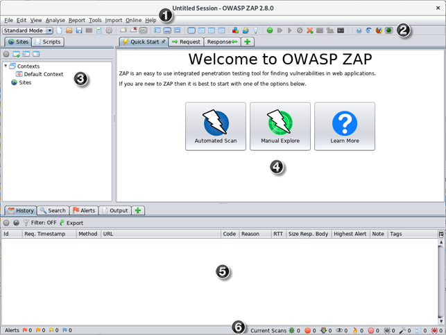
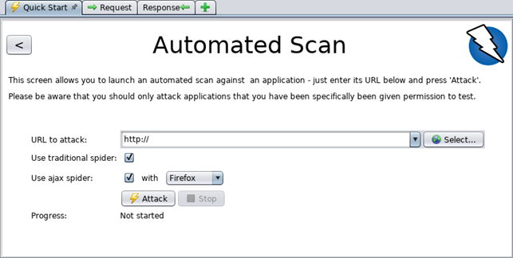

# OwaspZap

OwaspZap es una herramienta que permite escanear servidores web y comprobar si existe algún tipo de fallo de seguridad conocido.

Cuando inicie ZAP por primera vez, la herramienta preguntará si deseas mantener la sesión de ZAP. De forma predeterminada, las sesiones ZAP siempre se graban en el disco en una base de datos HSQLDB con un nombre y una ubicación predeterminados. Si la sesión no persiste, esos archivos se eliminarán al cerrar la sesión.

Si eliges mantener una sesión, la información de la sesión se guardará en la base de datos local para que pueda acceder a ella más tarde. También podrá proporcionar nombres personalizados y ubicaciones para guardar los archivos.

Por ahora, seleccione “No”, no quiero persistir en esta sesión en este momento. Luego haga clic en Iniciar. Las sesiones de ZAP no se mantendrán por ahora.

**Interfaz de usuario de escritorio ZAP**

La interfaz de usuario de ZAP Desktop se compone de los siguientes elementos:

- Barra de menú: Brinda acceso a muchas de las herramientas automáticas y manuales.
- Barra de herramientas: Incluye botones que facilitan el acceso a las funciones más utilizadas.
- Ventana de árbol: Muestra el árbol de Sitios y el árbol de Scripts.
- Ventana del área de trabajo: Muestra solicitudes, respuestas y scripts y le permite editarlos.
- Ventana de información: Muestra detalles de las herramientas automáticas y manuales.

Pie de página: Muestra un resumen de las alertas encontradas y el estado de las principales herramientas automatizadas.

**Ejecución de un escaneo automatizado**

La forma más sencilla de empezar a utilizar ZAP es a través de la pestaña Inicio rápido. Quick Start es un complemento de ZAP que se incluye automáticamente cuando instala ZAP.

**Para ejecutar un escaneo automatizado de inicio rápido:**

- Inicie ZAP y haga clic en la pestaña Inicio rápido de la ventana del área de trabajo.
- Haga clic en el botón grande de Escaneo automatizado.
- En el cuadro de texto URL para atacar, ingrese la URL completa de la aplicación web que desea atacar.
- Haga clic en el ataque

ZAP procederá a rastrear la aplicación web con su araña y escaneará pasivamente cada página que encuentre. Luego, ZAP utilizará el escáner activo para atacar todas las páginas, funcionalidades y parámetros descubiertos.

 

Además, ZAP proporciona 2 arañas para rastrear aplicaciones web, las cuales se pueden seleccionar desde esa misma pantalla.

 

La araña ZAP tradicional que descubre enlaces examinando el HTML en las respuestas de la aplicación web. Esta araña es rápida, pero no siempre es efectiva cuando se explora una aplicación web AJAX que genera enlaces usando JavaScript.

Para las aplicaciones AJAX, es probable que la araña AJAX de ZAP sea más eficaz. Esta araña explora la aplicación web invocando navegadores que luego siguen los enlaces que se han generado. La araña AJAX es más lenta que la araña tradicional y requiere una configuración adicional para su uso en un entorno "sin cabeza".

ZAP escaneará pasivamente todas las solicitudes y respuestas enviadas a través de él. Hasta ahora, ZAP solo ha realizado análisis pasivos de su aplicación web. El escaneo pasivo no cambia las respuestas de ninguna manera y se considera seguro. El escaneo también se realiza en un hilo de fondo para no ralentizar la exploración. El escaneo pasivo es bueno para encontrar algunas vulnerabilidades y como una forma de tener una idea del estado de seguridad básico de una aplicación web y ubicar dónde se puede justificar una mayor investigación.

Sin embargo, el análisis activo intenta encontrar otras vulnerabilidades mediante ataques conocidos contra los objetivos seleccionados. El escaneo activo es un ataque real a esos objetivos y puede ponerlos en riesgo, así que no utilice el escaneo activo contra objetivos para los que no tiene permiso para probar.

**Ver alertas y detalles de alertas**

En el lado izquierdo del pie de página ZAP nos muestra un recuento de las alertas encontradas durante el testeo, desglosadas en categorías de riesgo, las cuales son:

Para verlas solo debemos seguir los siguientes pasos:

- Hacer click en la pestaña “Alertas” en la ventana de información.
- Hacer click en cada alerta que se muestra en esa ventana para mostrar la URL y la vulnerabilidad detectada en el lado derecho de la Ventana de información.
- En las ventanas del área de trabajo, hacer click en la pestaña Respuesta para ver el contenido del encabezado y el cuerpo de la respuesta. Se resaltará la parte de la respuesta que generó la alerta.

 

**Generación de informes en ZAP**

Una vez que se realiza el escaneo activo, podemos generar informes. Para eso simplemente debemos hacer click en “OWASP ZAP” >> “Informe” >> “generar informes HTML” >> “ruta de archivo proporcionada” >> “informe de escaneo exportado”.

Y esto sería todo por el momento. Próximamente haremos un nuevo artículo en el cual explicaremos como explorar una aplicación manualmente, además de explicar algunas de las funciones avanzadas de esta herramienta.

**Escrito por Mikel Hernández Alonso**

https://www.linkedin.com/in/mikel-hernandez-alonso-a3975b205/