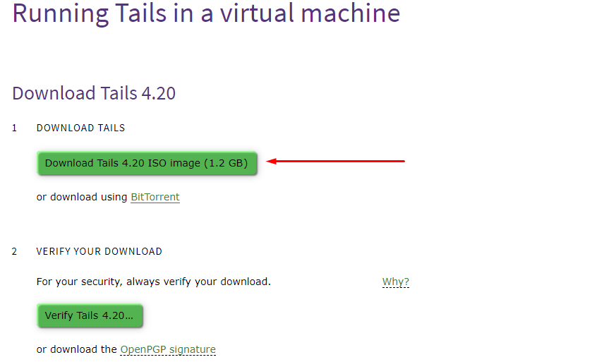
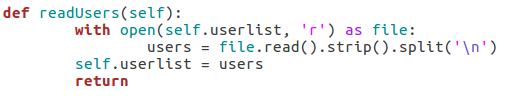
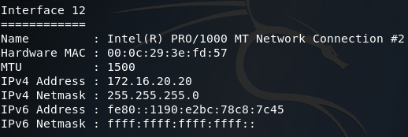

# Análisis forense digital: cómo revertir las amenazas cibernéticas

La ciencia forense digital cubre la identificación, recuperación, análisis y preservación de evidencias o pruebas en el sistema digital. En la era de la tecnología, la actividad fraudulenta se volvió algo común. Requirió de expertos en ciberseguridad, una rama particular de nómadas digitales que pueden rastrear la escena pero sentados detrás de una computadora. Los dispositivos digitales dejan rastros de actividad y datos. Un experto en ciencia forense digital puede modificarlos o abrirlos para saber qué está sucediendo e informar en consecuencia. Reparar la vulnerabilidad también es parte del trabajo. La mayoría de las veces, trabajan con el gobierno o equipos de seguridad especializados. Sin embargo, para calificar como experto en ciencia forense digital, se requieren conocimientos de extracción de datos de varios dispositivos y sistemas operativos.

Los expertos forenses digitales también se conocen como especialistas en seguridad de la información, ingenieros forenses digitales, investigadores forenses digitales, examinadores forenses digitales, analistas forenses digitales, especialistas forenses digitales, etc. Aunque hay muchos nombres con los que podemos llamar a un experto forense que trabaja en seguridad ofensiva, su objetivo es bastante el mismo. Es el nivel de experiencia lo que diferencia en qué categoría debe trabajar el especialista. Alguien con más experiencia trabaja en infracciones y amenazas de alto nivel. Por otro lado, los expertos forenses con menos experiencia trabajan con empresas más pequeñas y atienden a los clientes directamente.

Ahora más que nunca, la gente realiza sus tareas de oficina, transacciones y otras tareas delicadas en línea. Junto con ello, el sistema de justicia penal también se puso en línea. Estas máquinas tragamonedas cuentan con expertos que saben cómo analizar digitalmente la escena de un crimen. A medida que las empresas se conectan a Internet, cuentan con al menos una computadora que ayuda con la conectividad en línea. Puede abrir una puerta trasera para terceros interesados. Los delincuentes y los piratas informáticos pueden infiltrarse en el sistema y robar información.

## **¿Qué hace un experto forense digital?**

Los expertos del sector pueden extraer pruebas de todo tipo de sistemas informáticos y preparar informes en consecuencia. Los ciberataques pueden ir más allá de los servicios típicos de sitios web. Los expertos en análisis forense digital ven a través de eso y encuentran una falla en el sistema que utilizó el atacante y la rastrean. Incluso si ya no hay rastros disponibles, un experto intentará determinar cómo se produjo el ataque. Al final, solucionará el problema minimizando las pérdidas y cerrando el punto débil.

Reconstruir información digital, analizar datos y resolver crímenes son las actividades cotidianas de un experto forense digital. Otras tareas con este título incluyen la recuperación de datos del disco duro, la búsqueda y exploración de pruebas, la redacción de informes de investigación, el trabajo con el departamento de seguridad, etc. También se les llama a las casas de la escena del crimen para recuperar archivos de las máquinas de las víctimas protegidas del público y que tienen credenciales de inicio de sesión seguras. Las empresas privadas y el gobierno contratan solo al mejor experto forense digital, ya que es un trabajo delicado. Incluso antes de contratar a un experto, el departamento de seguridad y cumplimiento de la ley realiza una rápida verificación de antecedentes del individuo. Puede ser tanto digital como social.

Anteriormente, la ciencia forense digital se conocía como ciencia forense informática, pero los dispositivos móviles, la computación en la nube, la Internet de las cosas (IdC) y las tecnologías de ciberseguridad se han vuelto más amplias y han dado lugar a un sector en el que las personas pueden ir mucho más allá del conocimiento técnico y diseñar flujos de trabajo seguros.

## **Licencias y Certificaciones:**

No existe un límite de conocimientos y experiencia que sea más que suficiente. A medida que la ciberseguridad evoluciona gradualmente, también lo hacen las técnicas y la educación. Un experto en informática forense debe estar al tanto del sistema. Pero para convertirse en un veterano experimentado en el sector, se requieren algunas licencias. Pueden variar según los requisitos de una organización a otra. Los investigadores privados deben pasar una verificación de antecedentes penales y, lo más importante, exámenes de licencia.

Existen muchas certificaciones disponibles que ayudan a acceder a un puesto de trabajo profesional. Sin embargo, no se requiere un título universitario, pero permite obtenerlo. Los expertos en análisis forense digital suelen ingresar al sector a través de una certificación y la asistencia de los empleadores. Algunas certificaciones son:

- Examinador forense informático certificado (CCFE)
- Probador de penetración certificado (CPT)
- Analista certificado de ingeniería inversa (CREA)
- Examinador de Computación Certificado (CCE)
- Examinador forense de computadoras certificado (CFCE)
- Hacker ético certificado (CEH)
- Examinador certificado de EnCase (EnCE)
- Analista forense certificado (GCFA)
- Profesional certificado en seguridad de sistemas de información (CISSP)
- Sociedad Internacional de Examinadores Forenses de Informática (ISFCE)
- Certificaciones de seguridad de la información global (GIAC)

También hay algunos pasos que ayudan mucho a convertirse en un experto forense digital; son:

Educación: Los títulos y programas universitarios son esenciales para llegar a los empleadores potenciales y elegir una carrera profesional. Ciencias de la Computación, Ingeniería Informática, Seguridad de la Información, Matemáticas y Ciberseguridad son algunos de los cursos más beneficiosos.

Mantenerse actualizado: No podemos enfatizar esto lo suficiente, ya que la habilidad práctica en el sector es importante y diferencia a un aficionado de un profesional. La mayoría de las personas con un nivel técnico avanzado explorarían los sectores de la ciberseguridad y el hacking ético, pero no irían tan lejos como para dedicarse a una carrera profesional. Sin embargo, un hobby ayuda a mantenerse ocupado y a adquirir un conjunto de habilidades esenciales. Pero para ser competente en un campo, hay mucho trabajo duro involucrado.

Elegir una carrera: Elegir una carrera en el sector forense digital implica formación profesional, educación, experiencia y un cierto nivel de adaptación. Puede resultar bastante difícil para los jóvenes elegir el sector forense en lugar del desarrollo de software u otras categorías. Hay muchas organizaciones profesionales como el Grupo de Trabajo Científico sobre Evidencia Digital ( [SWEDGE](https://www.swgde.org/) ) que dan la bienvenida a la gente en la escena.

## **Experiencia para convertirse en Experto Forense Digital:**

Ya hemos dividido el sector en muchas categorías esenciales para cada aspecto de convertirse en un experto en análisis forense digital. Pero lo que importa en la industria y está por encima de todo es la experiencia. Un experto en análisis forense digital es una persona altamente técnica con mucha experiencia en el campo. Aspectos básicos que uno debe tener en cuenta:

- Programación de nivel intermedio a avanzado en múltiples lenguajes, por ejemplo, Python, Java, Bash, PHP, C+, ensamblador, etc.
- Comprensión de bajo nivel de términos altamente técnicos.
- Conocimiento del lado del servidor con asignación de datos, modificación con diferentes niveles de acceso.
- Sistemas operativos, incluidas distribuciones basadas en Linux, móviles.
- Red y hardware.
- Herramientas y scripts forenses, capacidad de desarrollar un script individual para casos personalizados.
- Descifrado de contraseñas, no solo ataques de fuerza bruta o de diccionario.
- Copia de seguridad y limpieza de rastros.
- Cifrado, descifrado, criptografía, hashing, etc.
- Capacidad de reunir recursos delicados cuando sea necesario y pedir ayuda sin dudarlo.

Por supuesto, hay muchas más, y al atravesarlas se desbloquearán más puertas.

## **Entendiendo la investigación forense de datos:**

Los dos tipos de sistemas de archivos más comunes son NTFS y FAT. En el pasado, no había unidades de disco duro disponibles. El sistema de asignación de archivos (FAT) se utilizaba en los ordenadores personales. Se utilizaba para señalar los archivos que iniciaban el clúster. Así era como se utilizaban los archivos. FAT podía almacenar información sencilla como nombres de archivos, fecha, hora, atributos de archivos y nombres de directorios. Pero después de que tuvimos éxito con la tecnología, aparecieron nuevos formatos de almacenamiento que son fáciles de usar y más rápidos. Más rápido significa que se puede hacer más trabajo de manera eficiente, sin consumir demasiados recursos. FAT32, FAT 12, FAT 16, VFAT fueron algunas de las variantes.

Una vez que el mercado de las computadoras comerciales explotó, NTFS tomó al mundo por asalto. Mató a FAT para mejorar los sistemas informáticos. Tienen atributos de archivo mejorados, flujos de datos alternativos, compresión de archivos, cifrado como LZ77, punto de montaje, copia de sombra, etc. Agregan volumen lógico al sistema, lo cual es genial para archivos y tareas, pero al mismo tiempo los hace más difíciles de descifrar. Diferentes métodos y protocolos pueden rodear el proceso de extracción de datos cuando se plantea un requisito. Es uno de los puntos importantes y no podíamos irnos sin mencionarlo.

## **Resumiendo:**

Con el rápido crecimiento de la tecnología, convertirse en un experto forense digital debería suponer un gran impulso en el inicio de su carrera profesional. La demanda crece constantemente en el sector tecnológico y, si bien hay muchos programadores excelentes, los expertos forenses dedicados son un poco escasos. Para llenar ese vacío, necesitamos la mayor cantidad posible de personas con experiencia.

Las agencias de seguridad, las organizaciones, los departamentos de ciberdelincuencia y los administradores de redes siempre están buscando expertos en análisis forense digital. Pagan salarios altos a los candidatos adecuados. Según PayScale, el salario promedio de los expertos en análisis forense digital oscila entre 50.000 y 114.000 dólares, y en un puesto se ofrecían incluso 160.000 dólares. Además, se ofrecen beneficios a la empresa y un lugar de trabajo realmente motivador.

## [Cómo instalar Tails OS en VirtualBox](https://www.hackingloops.com/install-tails-virtualbox/)

Es bastante fácil instalar una distribución Linux basada en Debian como Tails OS. Aunque se puede instalar de forma similar a Windows, existe un método más sencillo y recomendado. Se trata de utilizarla en un entorno sandbox plug-and-play. Podemos configurar un entorno en vivo con DVD, unidad flash USB y VirtualBox.

VirtualBox facilita enormemente la prueba de cualquier sistema operativo dentro de otro y no causa problemas de seguridad.

Sigue esta guía para conocer los protocolos adecuados para instalar Tails OS en Virtualbox. Si no tenemos cuidado en Internet, podemos dejar rastros de información sensible o incluso de rastreadores.
Por este motivo, especialistas en ciberseguridad, periodistas y muchos otros utilizan sistemas de distribución basados ​​en Linux como Tails OS en VirtualBox.

## **¿Por qué instalar Tails OS en VirtualBox?**

Tails OS proviene de The Tails Project y es un sistema de distribución Linux flexible. Está centrado en la seguridad y en Tor. Tor significa The Onion Router, que permite el anonimato en la red mundial.

Tails OS utiliza la red Tor para apoyarse en todas las herramientas que ofrece la distribución. Y en un entorno de VirtualBox, Tails OS tiene más sentido porque se filtrarán sus conexiones entrantes y salientes. Y lo mejor es que, una vez que hayamos terminado con el propósito para el que se instaló Tails, se asegurará de que no quede ninguna huella ni rastreador.

## **Cómo instalar Tails OS en VirtualBox**

Descargar e instalar Tails OS en VirtualBox es bastante sencillo. Vamos a ser generosos con el proceso y lo haremos en cuatro sencillos pasos.

**Paso 1: Descarga e instalación de VirtualBox**
Este paso es bastante sencillo y estamos bastante seguros de que muchos de ustedes ya tienen VirtualBox instalado. Para ellos, continúe con el segundo paso. Si no es así,[ descargue](https://www.virtualbox.org/wiki/Downloads) la versión deseada de VirtualBox e instálela. Es como cualquier otra aplicación instalada. Elija una unidad y realice la configuración inicial
**Paso 2: Descarga e instalación de Tails OS en VirtualBox**
Aquí es donde las cosas se ponen interesantes, ya que hacemos la configuración inicial para ejecutar el entorno sandbox y crear nuestra estación de trabajo.
El procedimiento inicial aquí es descargar la imagen de disco de Tails OS. Lo cual es bastante fácil. Simplemente vaya a[ tails.boum.org](https://tails.boum.org/) o busque Tails OS en Google.

Seremos recibidos con un sitio web de color morado con las adecuaciones de apoyo.

Haga clic en “Para máquinas virtuales (imagen ISO)” y accederá a la página de descarga.

Una vez descargado, podemos verificar la descarga a través de Verify Tails. Después de completar la verificación, podemos estar seguros de que el archivo que descargamos es seguro y está listo para usar.

Ahora, iniciemos VirtualBox y agreguemos el sistema operativo Tails. Haga clic en el botón azul “Nuevo” dentro del Administrador de Oracle VM VirtualBox.

 

Tenemos la opción de configurar un nombre para el SO. En “Tipo” vamos a seleccionar “Linux” ya que es una distribución basada en Linux. En versión, selecciona otro Linux (64 bits). Ya que 64 bits tiene una mayor compatibilidad en una computadora moderna que 32 bits.
Pero si eliges usar la versión de 32 bits, entonces desde la configuración selecciona Habilitar PAE/NX

A continuación, aparecerá una opción para el tamaño de la RAM. Tails OS no requiere muchos recursos, por lo que los 512 MB de RAM predeterminados son suficientes para realizar nuestro trabajo. Le daremos un poco más de espacio y lo configuraremos con 1 GB (1024 MB) de RAM.

Para el disco duro, “Crear un disco duro virtual ahora” y presione Siguiente.

El tipo de archivo del disco duro debe ser “VDI (imagen de disco virtual)”.

Almacenamiento en disco duro físico, seleccione “Asignación dinámica”. De lo contrario, pueden surgir algunos problemas si no se maneja correctamente. Solo le damos la mejor configuración predeterminada para que se puedan realizar otros ajustes más adelante.

La pestaña de ubicación y tamaño de archivo ofrece la opción de elegir espacio para el sistema operativo. Nuevamente, lo mantendremos por defecto. No se conocen problemas al realizar ajustes con esta opción. Si tienes espacio para más y estás seguro de que vas a necesitar ese espacio, entonces sigue adelante y aumenta esa configuración.

**Paso 3: Configuración para Tails OS en VirtualBox**
Ahora hemos terminado de configurar nuestro VirtualBox con Tails OS. Pero antes de iniciar, algunas configuraciones de optimización pueden resultar de gran ayuda.

Haga clic derecho en nuestro sistema operativo y aparecerán varias opciones, y la primera es la configuración. Vamos a seleccionarla y optimizarla correctamente. Esta es la configuración de la máquina para el sistema operativo.

Desde el sistema y el procesador, le daremos una CPU más y deshabilitaremos el PAE. Úselo si se utilizan 4 GB o más de memoria en el sistema.
Ahora vayamos a almacenamiento y dirijamos nuestro archivo. Haga clic en Vaciar y desde el ícono del lado derecho podemos navegar hasta el iso. Lo descargamos anteriormente y debería estar en la carpeta de descarga predeterminada.

A veces, el archivo ISO puede no aparecer. En este caso, tenemos que seleccionar manualmente el ISO en la ventana del explorador que aparece después de hacer clic en el icono del disco.
Y ya hemos terminado de configurar el entorno y la primera ejecución de nuestro sistema operativo Tails recién instalado en VirtualBox.

**Paso 4: Iniciar Tails OS en VirtualBox**
Nos alegra que hayas llegado hasta aquí y hayas realizado el procedimiento de instalación. Ahora es el momento de obtener el resultado final y de iniciar nuestro nuevo sistema operativo. Presionemos el botón de inicio.

Esta ventana es el primer arranque del sistema operativo Tails. Seleccionará automáticamente el sistema operativo Tails predeterminado. No es necesario hacer clic en ningún botón.

La siguiente ventana emergente es donde vemos Tails OS por primera vez en nuestro entorno recién configurado. Haga clic en Iniciar Tails si desea la configuración predeterminada.

En las versiones anteriores de Tails OS, solo hacía falta hacer clic en Iniciar sesión y ya estábamos listos. Las versiones actualizadas nos preguntan si queremos el método más seguro o el más fácil para conectarnos a la red Tor, ya que Tails depende de Tor. Para esta demostración, simplemente haremos clic en Conectar automáticamente, "Más fácil" y nos conectaremos.

Iniciará una conexión con la red Tor sin puentes y puede tardar algún tiempo.

Dado que pasamos por muchos túneles e identificamos protocolos de seguridad, será más lento que nuestra conexión de red habitual.

Nos dará la bienvenida el mensaje "Conectado a Tor con éxito" y es un alivio. Y ahora tenemos anonimato en Internet y somos libres de hacer nuestra propia investigación con el sistema operativo Tails en VirtualBox.

Al ingresar a Google.com con el navegador Tor desde la aplicación, parece que nuestro idioma no es inglés y el navegador se confunde. Al buscar “mi ubicación” o “whatsmyip.org”, nos encontramos en ubicaciones diferentes a las reales.

Aquí hay una captura de pantalla de cuando se abre el navegador Tor por primera vez. Cubrimos la IP a pesar de que se creó de manera aleatoria.

Y así es como se instala Tails OS en VirtualBox.

## **Resumen:**

Muchos profesionales recomiendan Tails OS en VirtualBox. Aunque nada es totalmente seguro y solo se mantiene seguro según lo que hagan los usuarios. Podemos personalizar aún más el sistema operativo según nuestros gustos. Por ejemplo, cambiando la resolución de la configuración de pantalla que se adapte a nuestras necesidades. Configurar una cuenta de usuario es una buena práctica. Las funciones del explorador de archivos tienen sistemas GUI, por lo que se parecen bastante al sistema operativo Windows. Si los usuarios dejan información intencional que se puede rastrear, arruinan el propósito de Tails. Aunque Tails OS es bastante seguro en sí mismo y cubre la mayoría de los defectos, siempre debemos respetar la privacidad en línea y no involucrarnos en actividades maliciosas.

## [Enumeración de usuarios SMTP de Python para pruebas de penetración](https://www.hackingloops.com/python-enumeration-test-smtplib/)

¡Bienvenidos de nuevo, mis queridos hackers! Hace poco estuve pensando y me di cuenta de que en HackingLoops no hemos estado creando ninguna herramienta casera, así que decidí cambiar eso. Hoy vamos a aprender sobre la enumeración de usuarios SMTP, así como a crear una herramienta de enumeración propia y a llevar las cosas más allá de simplemente usar **smtplib de Python** para enviar correos electrónicos.

Primero, analizaremos el protocolo SMTP y luego continuaremos con los propósitos y el potencial de esta enumeración. Una vez que hayamos cubierto eso, analizaremos los métodos que podemos usar para enumerar estos usuarios y **probar smtp** . Después de todo lo dicho y hecho, comenzaremos a construir nuestro propio script. ¡Comencemos!

# **El protocolo SMTP y la enumeración de usuarios**

## **¿Qué es SMTP?**

SMTP, abreviatura de Protocolo simple **de** **transferencia** de **correo** , define los estándares utilizados para transmitir correo electrónico entre sistemas. SMTP no sólo **lo** utilizan los servidores de correo para retransmitir mensajes entre sí, sino que también lo utiliza el cliente de correo electrónico del usuario final para transmitir un mensaje al servidor de correo para su posterior retransmisión.

## **¿Qué es la enumeración de usuarios SMTP?**

Estos servidores SMTP tienen *usuarios* registrados y estos usuarios tienen direcciones de correo electrónico. Al enviar sondas al servidor en forma de ciertos comandos, podemos saber si un usuario determinado existe. Al repetir este proceso una y otra vez con una lista de nombres de usuario diferentes, podemos identificar una multitud de usuarios o direcciones de correo electrónico en el servidor de destino. Al verificar la existencia de estos usuarios, podemos proceder a enviar ataques de phishing directamente dirigidos a ellos.

## **¿Cómo funciona la enumeración de usuarios SMTP?**

**Hay 3 comandos en el protocolo SMTP que** podemos usar para enumerar un usuario: VRFY, EXPN y RCPT TO. El comando VRFY es la abreviatura de verificar y **,** **en** realidad, está *destinado* a validar nombres de usuario y direcciones. Debido a su propósito innato, muchos administradores deshabilitan el comando VRFY para detener a los spammers. El comando EXPN es muy similar al comando VRFY y realmente no requiere una explicación adicional.

Sin embargo, el método RCPT TO es diferente. Primero, debemos analizar el comando MAIL FROM. Este comando identifica la dirección de origen de un correo electrónico que se está enviando. Una vez que enviamos un comando MAIL FROM, utilizamos el método RCPT TO para identificar los destinatarios del correo electrónico. Al repetir los comandos RCPT TO después del comando MAIL FROM y nunca terminar el correo electrónico iniciado, podemos identificar la existencia de cualquier usuario que queramos. Ahora que entendemos SMTP y la enumeración de usuarios SMTP, ¡comencemos a crear nuestro script!

(Nota: el script se puede encontrar [aquí](https://pastebin.com/axyPa2BM) en Pastebin. Las capturas de pantalla aquí no tienen comentarios, pero la publicación de Pastebin sí, por lo que le sugiero que la mantenga abierta y la consulte mientras la revisamos aquí).

# **Construyendo el script de enumeración**

## **Paso 1: Iniciar el script e inicializar la clase**

Para simplificar, todas nuestras funciones estarán alojadas en una única *clase* . Una vez que hayamos completado estas funciones, podremos crear una instancia de esta clase y ejecutar las funciones según sea necesario. En este paso, primero vamos a configurar la ruta de nuestro intérprete, importar un módulo que necesitaremos e inicializar nuestra clase:

Como puede ver, en este punto solo necesitamos un único módulo, *socket* . El módulo socket nos permitirá crear y utilizar conexiones de red. Nuestra clase también toma una serie de argumentos, que son: la dirección IP del objetivo, el archivo que contiene los nombres de usuario para probar, el número de puerto al que conectarse en el objetivo, un tipo de escaneo y una dirección para usar si se requiere un comando MAIL FROM (método RCPT). Además, se crean dos atributos self vacíos, *self.sock* contendrá más tarde el objeto socket que se conecta al objetivo y *self.targetBanner* almacenará el banner del servidor de destino cuando nos conectemos por primera vez.

## **Paso 2: Función para leer la lista de usuarios**

A continuación, crearemos la función que leerá el archivo que contiene la lista de nombres de usuario proporcionada cuando se creó el objeto. En nuestra función *init* , almacenamos la ruta al archivo en *self.userlist* . Con esto, podemos leer y analizar el archivo, después de lo cual podemos almacenar la nueva lista en *self.userlist* , reemplazando la ruta del archivo:

Dado que esta función no se ejecutará hasta más tarde, nuestra lista de usuarios permanecerá sin leer hasta que la llamemos. Sin embargo, una vez que se la llame, la lista se leerá y se almacenará.

## **Paso 3: Función para construir y manipular sockets**

Naturalmente, con un script como este, utilizaremos sockets para realizar y utilizar las conexiones con el servidor de destino. Para facilitar la implementación de estos sockets, crearemos un par de funciones para gestionar su creación:

Nuestra primera función, *buildSock()* , sigue estos pasos: crea el objeto socket, conecta el socket a la dirección IP de destino en el número de puerto de destino, almacena este objeto socket conectado en *self.sock* , recibe el banner del servidor y almacena el banner del servidor en *self.targetBanner* (si aún no se ha almacenado allí). La función *closeSock()* es simple y no es realmente necesaria, pero nos ahorra la repetición de algunas líneas de código más adelante. Simplemente cierra el objeto socket en *self.sock* y restablece su valor a *None* .

## **Paso 4: Función para comprobar la vulnerabilidad a escanear**

Esta función leerá el tipo de escaneo que se eligió y probará el servidor de destino para asegurarse de que sea vulnerable antes de que comience la enumeración. Podemos hacerlo intentando usar estos comandos:

La primera prueba es la prueba VRFY, que enviará un comando VRFY vacío al objetivo. Si el objetivo responde con *501* (el [código de respuesta SMTP](https://www.greenend.org.uk/rjk/tech/smtpreplies.html) para un error de sintaxis), entonces el comando VRFY estará disponible para ser utilizado. La segunda prueba comprobará si hay vulnerabilidades en el método EXPN. Esto se puede lograr enviando un comando EXPN vacío, y si el objetivo responde con un *502* (comando no reconocido), entonces el comando EXPN no funcionará. La prueba final es para el comando RCPT. Comenzamos enviando nuestro comando MAIL FROM que contiene el nombre de usuario dado/predeterminado. Luego enviamos un comando RCPT TO dirigido al mismo usuario. Si el objetivo responde con *250* o *550* (OK o usuario desconocido), entonces el método RCPT TO estará disponible para su uso.

## **Paso 5: Funciones para sondear el objetivo en busca de un nombre de usuario**

Las próximas cuatro funciones estarán relacionadas con la búsqueda de un nombre de usuario determinado en el objetivo. Mostraré las capturas de pantalla y luego las analizaremos:

Estas tres funciones se comportan de forma similar entre sí y con respecto a la función para comprobar la vulnerabilidad de los objetivos en relación con el tipo de escaneo. Los comandos se repiten como antes, pero esta vez añadimos el nombre de usuario que nos gustaría enumerar al comando. Si el objetivo responde con *250* (OK), significa que el usuario existe (252 también es un valor aceptable para el método VRFY). Por último, tenemos esta función:

Esta función simplemente analiza la cadena que se proporcionó como tipo de escaneo cuando se creó la clase y busca en el objetivo un nombre de usuario determinado utilizando ese método de sondeo. Esto nos permitirá proporcionar nombres de usuario a una sola función mientras seguimos buscando en el objetivo utilizando el método adecuado.

## **Paso 6: Tomar y analizar argumentos**

Ahora que todas nuestras funciones están completas, podemos comenzar a armar el cuerpo de nuestro script. Primero, importaremos algunos otros módulos y luego configuraremos y analizaremos los argumentos para el script:

Aquí podemos ver que tenemos siete argumentos disponibles al usar este script. En primer lugar, tenemos la dirección IP de destino y el número de puerto, luego está la ruta del archivo a la lista de palabras que contiene los nombres de usuario que se van a sondear. También hay un interruptor para cada tipo de escaneo (uno de los cuales debe proporcionarse) y, finalmente, hay un indicador opcional para especificar el nombre de usuario/dirección de correo electrónico que se usará con el método RCPT TO.

## **Paso 7: Detección y notificación de entradas incorrectas**

Un gran problema en la creación de scripts es que las entradas de usuario no válidas pueden complicar el proceso. La forma más sencilla que he encontrado para combatir las entradas no válidas es asegurarse de no *recibir* nunca entradas no válidas. Podemos hacer esto ejecutando una serie de comprobaciones para asegurarnos de que todo esté en orden antes de continuar. Primero, validaremos la dirección IP de destino:

Comenzamos por verificar si se ha proporcionado un objetivo. Si no es así, podemos generar un error a través del analizador para indicarle al usuario que se requiere uno. Si *se* proporciona una dirección, podemos ejecutarla a través de la función *socket.inet_aton* , que generará un error si la dirección IP no es válida. Ahora que hemos manejado la validación de la IP de destino, deberíamos pasar a validar el número de puerto:

Este bloque del código comprobará que el número de puerto indicado se encuentre en el rango correcto de números enteros. Si no es así, se generará una excepción y se informará que el número de puerto no es válido. El bloque try/except también proporcionará este informe si la función *int()* genera un error (se proporciona un valor no entero). A continuación, comprobaremos que la ruta de la lista de palabras esté en orden:

En primer lugar, nos aseguramos de que se haya proporcionado una ruta de archivo. Si se proporcionó una ruta de archivo, utilizamos la función *os.path.isfile* para evaluar si el archivo existe o no. Si se proporcionó una ruta de archivo existente y se superan las comprobaciones, no sucede nada. A continuación, verificaremos el tipo de escaneo elegido:

Primero, extraemos todos los valores de tipo de escaneo de los argumentos y los colocamos en una lista. Luego, usamos una declaración *if* para decir esto: si hay más de un valor verdadero *o* cero valores verdaderos, devolvemos un error. Esto nos permitirá filtrar la entrada de tipo de escaneo no válida. Ahora que se han completado todas nuestras comprobaciones, podemos pasar a ejecutar la enumeración.

## **Paso 8: Realizar la enumeración**

Ahora que estamos comenzando nuestra enumeración, necesitamos crear una instancia de nuestro *SMTPUserEnumerator* y pasar todos los argumentos que recibimos:

El bloque *if* / *elif* simplemente identifica el tipo de escaneo que se eligió y almacena ese valor en *scantype* . Además, antes de construir el objeto enumerador, le enviamos al usuario: el tipo de escaneo elegido, la IP de destino y el número de puerto de destino. Ahora que tenemos nuestro objeto enumerador, podemos ejecutar la función *testScanType()* para validar la vulnerabilidad de destino antes de continuar:

Como puede ver aquí, hay tres posibles respuestas a la comprobación de vulnerabilidad: buena, mala y fallida. Un buen resultado significa que la función de comprobación ha devuelto un resultado verdadero, y un mal resultado significa que ha devuelto un resultado falso. Además, si se genera un error, la comprobación se informa como fallida y el script finaliza. Ahora que hemos comprobado el objetivo, podemos analizar la lista de nombres de usuario:

Esto se explica por sí solo: imprimimos que estamos analizando la lista de usuarios y luego llamamos a la función *readUsers()* en nuestro objeto enumerador. Si este proceso falla, el script lo indicará y saldrá. Una vez que se hayan leído los nombres de usuario, podemos pasar a la enumeración *real :*

Comenzamos nuestro bloque de código final imprimiendo cuántos nombres de usuario necesitamos probar. Una vez que lo hemos hecho, usamos *datetime.now()* para iniciar el reloj para rastrear la duración del escaneo. Luego, llamamos a *buildSock()* para volver a conectarnos al objetivo e imprimir el banner del servidor SMTP de destino. Luego, recorremos la lista de nombres de usuario y llamamos a la función *probeTarget()* para cada uno de ellos. Si un nombre de usuario se informa como bueno, lo imprimimos y continuamos.

Una vez que se completa la enumeración, llamamos a la función *closeSock()* y detenemos el reloj durante el tiempo que dure. Luego, imprimimos que el escaneo se completó e imprimimos la diferencia entre los dos valores de tiempo que tomamos (lo que da como resultado el tiempo transcurrido desde el inicio hasta el final). ¡Ahora que nuestro script está completo, solo queda una cosa por hacer!

## **Paso 9: Probar el script**

Probaremos nuestro script en un servidor ESMTP de Postfix que se ejecuta en una máquina virtual Ubuntu Server 16.04 LTS. Comenzaremos usando el indicador *–help* para imprimir la página de ayuda de nuestro script (se genera automáticamente con argparse):

¡Nuestra página de ayuda se ve bien! Sin embargo, antes de continuar con esta enumeración, necesitaremos crear una pequeña lista de nombres de usuario. Usaré el comando *cat* en la CLI de Kali para este propósito:

Bien, ahora tenemos nuestra lista de nombres de usuario almacenada en un archivo llamado *users* . Ahora que tenemos eso resuelto, podemos comenzar a probar nuestros diferentes tipos de escaneo, de los cuales comenzaremos con el método VRFY:

¡Y listo! ¡Nuestro script funciona! Ahora sigamos adelante y probemos el método de escaneo EXPN:

Nuestro script nos dice aquí que este objetivo no es vulnerable a este tipo de método de escaneo, lo cual es cierto (lo intenté manualmente con una sesión de telnet y el comando no se reconoce). Finalmente, tenemos nuestro método RCPT TO:

Ahí lo tienes, dos de nuestros tres métodos de escaneo funcionan en este objetivo. ¡Espero que esto te haya ayudado a aprender más sobre la enumeración de usuarios SMTP (definitivamente me ayudó a mí) y puedes esperar ver más scripts caseros en el futuro cercano!

(Nota: en caso de que no hayas visto el enlace anterior, el script se puede encontrar [aquí](https://pastebin.com/axyPa2BM) ).

## [Pivotando en Metasploit para hackear más profundamente una red](https://www.hackingloops.com/pivoting-in-metasploit/)

Hoy vamos a repasar algo en lo que he estado trabajando durante un tiempo: el pivoteo. Primero, hablaremos sobre qué es el pivoteo y por qué es importante. Luego, nos sumergiremos en nuestro laboratorio de hacking y lo probaremos por nosotros mismos.

# **¿Qué es el pivoteo?**

El pivoteo es un tema muy importante que debemos entender, ya que nos permite utilizar los sistemas que ya hemos comprometido para ver más profundamente la red. Por ejemplo, si un sistema tiene dos conexiones (dos redes diferentes) y una de las redes LAN es una red interna, podemos utilizar este sistema comprometido para *pivotear* hacia la red LAN interna, lo que nos expone una capa más profunda de la red. Afortunadamente, Metasploit viene con funcionalidades de pivoteo. Ahora que hemos cubierto qué es el pivoteo, vayamos a nuestro laboratorio y practiquemos.

# **Ejemplo de pivoteo**

## **El escenario**

Entonces, para que este laboratorio tenga un poco más de sentido, necesitaremos un segundo para configurar un escenario. Supongamos que pudimos infectar un servidor interno con una puerta trasera de enlace TCP. Lamentablemente, debido a circunstancias imprevistas, perdimos nuestro punto de apoyo en la red y ya no tenemos acceso a la red interna donde se encuentra el servidor con la puerta trasera. Nuestro objetivo ahora es obtener acceso a una PC de usuario final y pasar a nuestra puerta trasera en el servidor. ¡Comencemos!

## **El laboratorio**

Para este laboratorio, nuestro servidor con puerta trasera es una máquina virtual de 64 bits con Windows Server 2008 R2 y nuestra PC de usuario final es una máquina virtual de 32 bits con Windows 7 Pro. Como beneficio adicional, explotaremos Eternalblue y Doublepulsar para obtener acceso a nuestra PC de usuario final. Para poder usar este exploit en Metasploit, necesitamos instalarlo. Para ello, simplemente clonamos [este](https://github.com/ElevenPaths/Eternalblue-Doublepulsar-Metasploit) repositorio de Github, creamos algunos directorios y movemos un archivo:

Ahora que tenemos nuestro exploit instalado, iniciemos Metasploit y busquémoslo:

Después de seleccionar nuestro exploit, podemos usar el comando *show options* para enumerar todas las opciones que podemos configurar para este exploit:

Podemos dejar la información de la ruta intacta, pero necesitaremos cambiar PROCESSINJECT y RHOST así como también establecer una carga útil:

(Nota: el valor de PROCESSINJECT cambiará dependiendo de la arquitectura del sistema operativo víctima) Ahora que tenemos todo configurado como lo queremos, ejecutemos este exploit en la PC del usuario final:

Ahora que tenemos acceso a nivel de usuario a la PC del usuario final, necesitamos realizar una escalada de privilegios y obtener privilegios de SISTEMA. Para ello, utilizaremos [Schlamperei](https://www.rapid7.com/db/modules/exploit/windows/local/ms13_053_schlamperei) . Un uso rápido del comando *de búsqueda* en Metasploit debería darnos lo que estamos buscando:

Entonces, hemos encontrado nuestro exploit local. Seleccionémoslo con el comando *use* y configurémoslo para que apunte a nuestro sistema de usuario final comprometido:

Muy bien, ahora que tenemos privilegios de SISTEMA, podemos usar el comando *ipconfig* en meterpreter para ver a qué redes está conectada la PC comprometida:

Había bastante información, así que la ordené y encontré lo que necesitábamos. Aquí podemos ver dos interfaces de red que nos interesan. Primero, está la interfaz por la que llegamos para comprometer esta PC, luego hay otra interfaz que debería llevar a la LAN interna donde está la puerta trasera. Ahora que tenemos un punto de pivote (la PC del usuario final), podemos agregar una *ruta* a Metasploit que nos permitirá apuntar a esta red interna usando esta PC como puerta de enlace en:

Ahora que tenemos nuestra ruta en su lugar, sigamos adelante y usemos el módulo de escáner ARP en Metasploit para enumerar los hosts en la LAN interna. Ahora bien, dado que este es un entorno de laboratorio, solo habrá un host, nuestro servidor. Pero aún podemos usar este módulo para encontrar la dirección IP que necesitamos contactar para llegar a nuestra puerta trasera:

Una vez que tengamos todos nuestros valores configurados correctamente, podemos ejecutar nuestro escáner y encontrar la dirección IP del servidor:

Con los resultados del escaneo en mente, podemos usar el módulo *multi/handler* para conectarnos a nuestra puerta trasera que, en este caso, es un EXE meterpreter de 64 bits que escucha en el puerto 8080. Ahora que tenemos la ruta en su lugar y la dirección IP del servidor, deberíamos poder usar nuestra puerta trasera y tomar el control del servidor:

Ahora que volvemos a tener acceso a nuestro servidor con puerta trasera, podemos “exfiltrar” esos valiosos y confidenciales datos:

Por último, solo para asegurarnos de que tenemos el servidor correcto, usaremos el comando *sysinfo* para verificar el sistema operativo:

¡Y ya está! Nuestra primera incursión en el tema del pivoteo ha terminado, pero sin duda cubriremos más en el futuro. Aquí mostramos solo una técnica para pivotear, de las cuales Metasploit ofrece más. Si el pivoteo se combina con una variedad de técnicas de enumeración y ataques, ¡un atacante debería poder rastrear toda la red!

Ahora que hemos analizado cómo usar Metasploit para pasar de un sistema a otro y ganar una posición más sólida en una red (si aún no lo has leído, te sugiero que lo hagas), vamos a profundizar en este concepto realizando un reconocimiento de la red interna con herramientas que no sean de Metasploit. Primero, elaboraremos más nuestro escenario del último ejercicio de cambio de sistema y luego comenzaremos.

# **El escenario**

La última vez, nuestro escenario fue que logramos infectar un servidor interno, pero perdimos el acceso a la red interna. El laboratorio de ese artículo giraba en torno a obtener acceso a una PC de un usuario final y abrirnos paso hasta el servidor con puerta trasera. Esta vez, nos basaremos en este escenario.

Esta vez, nuestro escenario es el siguiente: nuestro equipo se ha enterado de un nuevo servidor FTP en las profundidades de la red de destino. Nuestro objetivo ahora es obtener acceso a este servidor FTP y robar todos los datos confidenciales que contenga. Para ello, haremos un cambio desde el servidor original con puerta trasera (lo que requerirá un cambio a través de la misma PC del usuario final). ¡Comencemos!

# **El laboratorio**

## **Paso 1: Inicie Metasploit**

Nota: Usé el indicador –quiet para hacer espacio para el comando **de servicio** en la captura de pantalla. Iniciar el servicio *postgresql* antes de iniciar Metasploit le permitirá acceder a la base de datos de módulos, lo que hará que el  comando **de búsqueda funcione** *mucho* más rápido.

## **Paso 2: Conéctese a la primera puerta trasera**

Para acceder al nuevo servidor FTP, primero debemos regresar a nuestro punto de apoyo en la red. Afortunadamente, tuve la idea de instalar una puerta trasera en la PC del usuario final mientras estábamos allí la última vez (¿ [ven lo que hice allí?](https://www.hackingloops.com/maintaining-access-metasploit/) ). Como tenemos esta puerta trasera instalada, podemos conectarnos fácilmente a la PC del usuario final y dirigirnos al servidor al que le pusimos una puerta trasera la última vez. Para conectarnos a la primera puerta trasera, usamos el módulo **multi/handler** en Metasploit:

Lamentablemente, nuestra puerta trasera no se ejecuta con privilegios de SISTEMA, podemos saberlo usando el comando **sessions** con el indicador **-l** :

Podemos intentar obtener privilegios de SISTEMA usando el comando **getsystem** dentro de la sesión meterpreter que acabamos de recibir, pero desafortunadamente no estamos en condiciones de que este comando funcione correctamente:

Parece que nos quedamos con los privilegios de usuario habituales, pero no teman. Un uso rápido del módulo **bypassuac** puede proporcionarnos los privilegios que buscamos:

Ahora, si interactuamos con esta segunda sesión de meterpreter y volvemos a ejecutar el comando **getsystem** , deberíamos ver que tenemos privilegios de SISTEMA:

## **Paso 3: Pasar a la segunda red**

Una vez que tenemos los privilegios que necesitamos, podemos usar el comando **ipconfig** dentro de meterpreter para mostrar todas las redes a las que está conectado el sistema del usuario final. Este comando genera una gran cantidad de resultados (la mayoría de los cuales no nos sirven), por lo que me tomé la libertad de analizarlos y seleccionar lo que necesitamos:

Aquí podemos ver la interfaz a través de la cual nos conectamos y una interfaz que da a una LAN interna. Esta segunda interfaz es la que necesitamos atravesar para llegar a nuestro servidor con puerta trasera original. Para lograr esto, podemos usar el comando **route** para agregar una ruta a la red interna a través de esta sesión:

## **Paso 4: Conéctese a la segunda puerta trasera**

Ahora que hemos establecido nuestro primer punto de pivote, podemos volver a utilizar el módulo **multi/handler** para contactar con la segunda puerta trasera que se encuentra en el servidor interno más cercano a nuestra PC de usuario final comprometida. Si recuerdas nuestro artículo de pivote anterior, la dirección IP del servidor originalmente afectado por la puerta trasera es 172.16.20.20. Con esta dirección IP podemos conectarnos a nuestra segunda puerta trasera:

## **Paso 4: Pivotar hacia la tercera red**

Ahora que nos hemos conectado a nuestra segunda puerta trasera, podemos usar nuevamente el comando **ipconfig** para encontrar la información de dirección del servidor al que acabamos de conectarnos:

Ahora que hemos encontrado la información de direccionamiento de los primeros servidores, podemos agregar una segunda ruta que nos permitirá pasar a la red 10.0.0.0/8. Una vez que tengamos nuestra ruta lista, usaremos el módulo **arp_scanner** para encontrar la dirección IP del segundo servidor (nota: asegúrese de configurar correctamente la máscara de subred en el módulo del escáner ARP, ya que configurarla incorrectamente puede generar resultados de escaneo erróneos):

## **Paso 5: Establecer un proxy para la reconstrucción de la red interna**

Para realizar un reconocimiento en una red interna, necesitaremos configurar un proxy dentro de Metasploit. Este proxy se ejecutará en el host local de nuestra máquina atacante. Dado que el proxy lo ejecuta Metasploit, conoce nuestros puntos de pivote, lo que nos permite utilizar cualquier herramienta que elijamos a través de nuestros puntos de pivote en lugar de usar solo Metasploit. Para establecer este proxy, usamos el módulo **server/socks4a :**

Ahora que nuestro proxy se está ejecutando en segundo plano (en el puerto predeterminado 1080), debemos editar la configuración de **proxychains** (el programa que usaremos para utilizar nuestro proxy recién creado). Este archivo de configuración se encuentra en **/etc/proxychains.conf** . Si nos desplazamos hasta el final, podemos ver que la configuración predeterminada es usar Tor (que normalmente se ejecuta en el puerto 9050). Todo lo que debemos hacer es reemplazar el número de puerto de Tor con el número de puerto de nuestro proxy:

## **Paso 6: Realizar un reconocimiento de la red interna**

Ahora que hemos configurado nuestro proxy y reconfigurado las cadenas de proxy, podemos usar cualquier herramienta que queramos a través de nuestros puntos pivote. En este caso, usaremos [nmap](https://nmap.org/) para realizar un escaneo del puerto de conexión TCP de la dirección IP que encontramos al escanear ARP la tercera red (10.0.0.20):

Como podemos ver en los resultados del análisis, ¡este es de hecho el servidor FTP que estamos buscando! Ahora solo tenemos que iniciar sesión y robar los datos que buscamos. Pero espere, ¡no tenemos ninguna credencial! No se preocupe, ya que podemos [robarlas](https://www.hackingloops.com/mimikatz/) simplemente  del servidor que ya hemos comprometido usando mimikatz.

## **Paso 7: Robar credenciales del servidor comprometido**

Para robar las credenciales que necesitamos para acceder al servicio FTP en el servidor que acabamos de escanear, usaremos mimikatz desde dentro de meterpreter. Podemos usar mimikatz emitiendo el comando **load mimikatz** y para robar las credenciales usaremos el comando **kerberos** :

Aquí podemos ver que hemos robado con éxito algunas credenciales de administrador, ¡ahora podemos acceder a ese servidor FTP!

## **Paso 8: Inicie sesión en el servidor FTP**

Ahora podemos usar nuestras credenciales robadas para iniciar sesión en el servidor FTP y robar esos gloriosos datos privados (nota: se debe usar el modo pasivo para evitar errores de FTP). Una vez que iniciemos sesión en el servidor, ejecutaremos el comando **dir** para ver qué archivos podemos robar:

Aquí podemos ver que hay un archivo llamado *private_file.txt* en este servidor FTP. Podemos descargar este archivo ejecutando el comando **get :**

Ahora que hemos descargado el archivo, abramos otra terminal y echémosle un vistazo:

¡Ya está! ¡Hemos robado el archivo que buscábamos! Pero no estoy del todo satisfecho con esto. Ya que estamos aquí, también podríamos comprometer el servidor en su conjunto, en lugar de simplemente iniciar sesión en el servicio FTP.

## **Paso 9: Comprometer el segundo servidor**

Lamentablemente, no parece que exista un exploit que podamos usar para obtener acceso a este servidor FTP. Afortunadamente para nosotros, podemos usar las credenciales que robamos para autenticarnos con el servidor a través de SMB ( **Server** **Message** Block ). Metasploit viene equipado para manejar esta situación con el **módulo** **psexec** . Seleccionemos el módulo y configuremos nuestras opciones:

Una vez que nuestras opciones estén configuradas, podemos usar el comando **exploit** y disparar:

¡Y ahí lo tenemos! Hemos logrado conectarnos a puertas traseras previamente establecidas, realizar un reconocimiento de una red interna con herramientas que no son de metasploit y comprometer un servidor recién establecido.